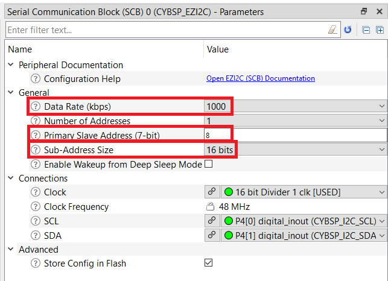

# EZ-PD&trade; PMG1 MCU: CAPSENSE&trade; CSD slider tuning

This code example demonstrates how to manually tune a CAPSENSE&trade; Sigma Delta (CSD)-based slider widget in EZ-PD&trade; PMG1-S3 device using the CAPSENSE&trade; Tuner.

[View this README on GitHub.](https://github.com/Infineon/mtb-example-pmg1-capsense-csd-slider-tuning)

[Provide feedback on this code example.](https://cypress.co1.qualtrics.com/jfe/form/SV_1NTns53sK2yiljn?Q_EED=eyJVbmlxdWUgRG9jIElkIjoiQ0UyMzUyMTUiLCJTcGVjIE51bWJlciI6IjAwMi0zNTIxNSIsIkRvYyBUaXRsZSI6IkVaLVBEJnRyYWRlOyBQTUcxIE1DVTogQ0FQU0VOU0UmdHJhZGU7IENTRCBzbGlkZXIgdHVuaW5nIiwicmlkIjoibnNoIiwiRG9jIHZlcnNpb24iOiIxLjAuMCIsIkRvYyBMYW5ndWFnZSI6IkVuZ2xpc2giLCJEb2MgRGl2aXNpb24iOiJNQ0QiLCJEb2MgQlUiOiJXSVJFRCIsIkRvYyBGYW1pbHkiOiJUWVBFLUMifQ==)


## Requirements

- [ModusToolbox&trade; software](https://www.infineon.com/modustoolbox) v3.0 or later (tested with v3.0)
- Board support package (BSP) minimum required version: 3.0.0
- Programming language: C
- Associated parts: [EZ-PD&trade; PMG1 S3 MCU](https://www.infineon.com/CY7113)


## Supported toolchains (make variable 'TOOLCHAIN')

- GNU Arm&reg; Embedded Compiler v10.3.1 (`GCC_ARM`) - Default value of `TOOLCHAIN`
- Arm&reg; Compiler v6.13 (`ARM`)
- IAR C/C++ Compiler v8.42.2 (`IAR`)


## Supported kits (make variable 'TARGET')

- [EZ-PD&trade; PMG1-S3 prototyping kit](https://www.infineon.com/CY7113) (`PMG1-CY7113`) - Default value of `TARGET`


## Hardware setup

For kit version older than **CY7113 board revision 3 or lower**, connect J6.10 to J3.8 and J6.9 to J3.10 to establish a UART connection between KitProg3 and the PMG1 device. 

See the kit user guide to ensure that the board is configured correctly.

**Note:** See [Compile-time configurations](#compile-time-configurations) for more details on enabling/disabling UART Debug print messages.


## Software setup

Install a terminal emulator if you don't have one. Instructions in this document use [Tera Term](https://ttssh2.osdn.jp/index.html.en).


## Using the code example

Create the project and open it using one of the following:

<details><summary><b>In Eclipse IDE for ModusToolbox&trade; software</b></summary>

1. Click the **New Application** link in the **Quick Panel** (or, use **File** > **New** > **ModusToolbox&trade; Application**). This launches the [Project Creator](https://www.infineon.com/ModusToolboxProjectCreator) tool.

2. Pick a kit supported by the code example from the list shown in the **Project Creator - Choose Board Support Package (BSP)** dialog.

   When you select a supported kit, the example is reconfigured automatically to work with the kit. To work with a different supported kit later, use the [Library Manager](https://www.infineon.com/ModusToolboxLibraryManager) to choose the BSP for the supported kit. You can use the Library Manager to select or update the BSP and firmware libraries used in this application. To access the Library Manager, click the link from the **Quick Panel**.

   You can also just start the application creation process again and select a different kit.

   If you want to use the application for a kit not listed here, you may need to update the source files. If the kit does not have the required resources, the application may not work.

3. In the **Project Creator - Select Application** dialog, choose the example by enabling the checkbox.

4. (Optional) Change the suggested **New Application Name**.

5. The **Application(s) Root Path** defaults to the Eclipse workspace which is usually the desired location for the application. If you want to store the application in a different location, you can change the *Application(s) Root Path* value. Applications that share libraries should be in the same root path.

6. Click **Create** to complete the application creation process.

For more details, see the [Eclipse IDE for ModusToolbox&trade; software user guide](https://www.infineon.com/MTBEclipseIDEUserGuide) (locally available at *{ModusToolbox&trade; software install directory}/docs_{version}/mt_ide_user_guide.pdf*).

</details>

<details><summary><b>In command-line interface (CLI)</b></summary>

ModusToolbox&trade; software provides the Project Creator as both a GUI tool and the command line tool, "project-creator-cli". The CLI tool can be used to create applications from a CLI terminal or from within batch files or shell scripts. This tool is available in the *{ModusToolbox&trade; software install directory}/tools_{version}/project-creator/* directory.

Use a CLI terminal to invoke the "project-creator-cli" tool. On Windows, use the command line "modus-shell" program provided in the ModusToolbox&trade; software installation instead of a standard Windows command-line application. This shell provides access to all ModusToolbox&trade; software tools. You can access it by typing `modus-shell` in the search box in the Windows menu. In Linux and macOS, you can use any terminal application.

The "project-creator-cli" tool has the following arguments:

Argument | Description | Required/optional
---------|-------------|-----------
`--board-id` | Defined in the `<id>` field of the [BSP](https://github.com/Infineon?q=bsp-manifest&type=&language=&sort=) manifest | Required
`--app-id`   | Defined in the `<id>` field of the [CE](https://github.com/Infineon?q=ce-manifest&type=&language=&sort=) manifest | Required
`--target-dir`| Specify the directory in which the application is to be created if you prefer not to use the default current working directory | Optional
`--user-app-name`| Specify the name of the application if you prefer to have a name other than the example's default name | Optional

<br>

The following example clones the "[CAPSENSE&trade; CSD slider tuning](https://github.com/Infineon/mtb-example-pmg1-capsense-csd-slider-tuning)" application with the desired name "MyCSDSliderTuning" configured for the *PMG1-CY7113* BSP into the specified working directory, *C:/mtb_projects*:

   ```
   project-creator-cli --board-id PMG1-CY7113 --app-id mtb-example-pmg1-capsense-csd-slider-tuning --user-app-name MyCSDSliderTuning --target-dir "C:/mtb_projects"
   ```

**Note:** The project-creator-cli tool uses the `git clone` and `make getlibs` commands to fetch the repository and import the required libraries. For details, see the "Project creator tools" section of the [ModusToolbox&trade; software user guide](https://www.infineon.com/ModusToolboxUserGuide) (locally available at *{ModusToolbox&trade; software install directory}/docs_{version}/mtb_user_guide.pdf*).

To work with a different supported kit later, use the [Library Manager](https://www.infineon.com/ModusToolboxLibraryManager) to choose the BSP for the supported kit. You can invoke the Library Manager GUI tool from the terminal using `make library-manager` command or use the Library Manager CLI tool "library-manager-cli" to change the BSP.

The "library-manager-cli" tool has the following arguments:

Argument | Description | Required/optional
---------|-------------|-----------
`--add-bsp-name` | Name of the BSP that should be added to the application | Required
`--set-active-bsp` | Name of the BSP that should be as active BSP for the application | Required
`--add-bsp-version`| Specify the version of the BSP that should be added to the application if you do not wish to use the latest from manifest | Optional
`--add-bsp-location`| Specify the location of the BSP (local/shared) if you prefer to add the BSP in a shared path | Optional

<br>

Following example adds the PMG1-CY7113 BSP to the already created application and makes it the active BSP for the app:

   ```
   ~/ModusToolbox/tools_3.0/library-manager/library-manager-cli --project "C:/mtb_projects/MyCSDSliderTuning" --add-bsp-name PMG1-CY7113 --add-bsp-version "latest-v3.X" --add-bsp-location "local"

   ~/ModusToolbox/tools_3.0/library-manager/library-manager-cli --project "C:/mtb_projects/MyCSDSliderTuning" --set-active-bsp APP_PMG1-CY7113
   ```

</details>

<details><summary><b>In third-party IDEs</b></summary>

Use one of the following options:

- **Use the standalone [Project Creator](https://www.infineon.com/ModusToolboxProjectCreator) tool:**

   1. Launch Project Creator from the Windows Start menu or from *{ModusToolbox&trade; software install directory}/tools_{version}/project-creator/project-creator.exe*.

   2. In the initial **Choose Board Support Package** screen, select the BSP, and click **Next**.

   3. In the **Select Application** screen, select the appropriate IDE from the **Target IDE** drop-down menu.

   4. Click **Create** and follow the instructions printed in the bottom pane to import or open the exported project in the respective IDE.

<br>

- **Use command-line interface (CLI):**

   1. Follow the instructions from the **In command-line interface (CLI)** section to create the application.

   2. Export the application to a supported IDE using the `make <ide>` command.

   3. Follow the instructions displayed in the terminal to create or import the application as an IDE project.

For a list of supported IDEs and more details, see the "Exporting to IDEs" section of the [ModusToolbox&trade; software user guide](https://www.infineon.com/ModusToolboxUserGuide) (locally available at *{ModusToolbox&trade; software install directory}/docs_{version}/mtb_user_guide.pdf*).

</details>


## Operation

This code example has already the necessary tuning setting by default. To verify the operation directly, Refer [Testing the basic operation](#testing-the-basic-operation). To understand the tuning process and to set the tuning value for EZ-PD&trade; PMG1-S3 device, Refer [Tuning stages](#Tuning-stages).

**Note:** Refer the section "Selecting CAPSENSE&trade; hardware parameters" in the [PSoC&trade; 4 and PSoC&trade; 6 MCU CAPSENSE&trade; design guide](https://www.infineon.com/AN85951) to know about parameters used for tuning.


### Tuning stages

Refer Figure 1 to understand the various stages of Tuning.

**Figure 1. Stages of tuning**


<details><summary><b> Stage 1: Measure Parasitic Capacitance (C<sub>P</sub>) </b></summary>
<br/>

Ensure that **Enable self-test library** option has been enabled in CAPSENSE&trade; Configurator which enables the macro `CY_CAPSENSE_BIST_EN`. (Disabling the **Enable self-test library** will disable the macro)

The function `Cy_Capsense_MeasureCapacitanceSensor()` gives the parasitic capacitance (C<sub>P</sub>) of each slider element. This function is defined under the macro `CY_CAPSENSE_BIST_EN` in the main.c file. LCR meter can also be used to measure the C<sub>P</sub> of the slider segments.

1. Open CAPSENSE&trade; Configurator in ModusToolbox&trade; software under **BSP Configurators** section. In the **Basic** tab, **LinearSlider0** is configured as **CSD (Self-cap)** with **5 Sensing Elements**. Change the CSD tuning mode to **Manual tuning**.

   **Figure 2. CAPSENSE&trade; Configurator - Basic tab**

   

2. Click **Advanced** tab. In the **General** sub-tab, Select the checkbox **Enable self-test library**.

   **Figure 3. CAPSENSE&trade; Configurator - Advanced tab**

   

3. Press **Ctrl+S** or Click **Save** option. Close the CAPSENSE&trade; Configurator.

4. Ensure that the board is connected to your PC using the USB cables through both the KitProg3 USB connector as well as the USB PD port, with the jumper shunt on power selection jumper (J5) placed at position 1-2.

5. In the Eclipse IDE, Select **\<Application Name> Debug (KitProg3_MiniProg4)** under the **Launches** section.

   For more details, see the "Program and debug" section in the Eclipse IDE for ModusToolbox™ software user guide: _{ModusToolbox™ install directory}/ide_{version}/docs/mt_ide_user_guide.pdf.

6. Place a breakpoint after the capacitance measurement function (`measure_cp`).

7. In the **Expressions** window, add two variables (`sense_cap` and `measure_status`)

   - `sense_cap`  contains the parasitic capacitance value (in femtofarads) for each slider.
   - `measure_status` contains the return value of the (C<sub>P</sub>) measurement function for each slider which reads `CY_CAPSENSE_BIST_SUCCESS_E` on success case.

8. Click the **Resume** button (green arrow) in the Toolbar to reach the breakpoint.

   **Figure 4. Capacitance value measured in Debug mode**

   

9. Click the **Terminate** button (red box) in the Toolbar to exit from Debug mode.

   **Table 1. C<sub>P</sub> values obtained for EZ-PD&trade; PMG1-S3 device using CAPSENSE&trade; Configurator**

   | Slider segment  | Parasitic Capacitance (Cp) (pF) |
   |:----------------|:--------------------------------|
   | Sns0            | 42                              |
   | Sns1            | 41                              |
   | Sns2            | 32                              |
   | Sns3            | 43                              |
   | Sns4            | 44                              |

<br>

</details>

<details><summary><b> Stage 2: Calculate Sense Clock Frequency </b></summary>
<br>

Sense clock frequency can be calculated using Equation 1.

   **Equation 1. Sense Clock Frequency**

   

Where,

- C<sub>P</sub> is the sensor parasitic capacitance.
- R<sub>SeriesTotal</sub> is the total series-resistance. This includes the 500-Ω resistance of the internal switches, the recommended external series resistance of 560 Ω or 2 kΩ (connected on the PCB trace connecting the sensor pad to the device pin), and the trace resistance if using highly resistive materials (for example Indium Tin Oxide (ITO) or conductive ink); that is, a total of 1.06 kΩ or 2.5 kΩ plus the trace resistance. 

Set the maximum possible sense clock frequency which will completely charge and discharge the sensor parasitic capacitance. Verify the charging and discharging of the sensor waveform with an oscilloscope by probing the sensor using an active probe.

Calculate the **Sense Clock Divider** in terms of the Sense Clock Frequency as shown in Equation 2.

**Equation 2. Sense Clock Divider**

 

Where,

- F<sub>MOD</sub> is the Modulator clock frequency (Here 48MHz is been used as modulator clock frequency)
- F<sub>SW</sub> is the Sense Clock frequency

**Table 2. Sense Clock Frequency and Sense Clock Divider for EZ-PD&trade; PMG1-S3 kit**

| Slider Segment | R<sub>SeriesTotal</sub> (kΩ) | Cp (pF) | Maximum Sense Clock Frequency (kHz) | Sense Clock Divider |
| :--------- | :------------    | :------------ | :------- | :---------|
| Sns0 | 1.06 | 41 | 2295 | 21 |
| Sns1 | 1.06 | 40 | 2323 | 21 |
| Sns2 | 1.06 | 32 | 2902 | 16 |
| Sns3 | 1.06 | 42 | 2224 | 21 |
| Sns4 | 1.06 | 43 | 2183 | 21 |

**Table 3. Selecting Sense Clock Frequency and Sense Clock Divider for EZ-PD&trade; PMG1-S3 kit**

|R<sub>SeriesTotal</sub> (kΩ) | Cp (pF) | Maximum Sense Clock Frequency (kHz) | Sense Clock Divider |
|:------------    | :------------ | :------- | :---------|
| 1.06 | 42 | 2224 | 21 |

Table 3 ensures the maximum possible sense clock frequency (for a good gain) while allowing the sensor capacitance to fully charge and discharge during each sense clock cycle.

</details>

<details><summary><b> Stage 3: Set the initial hardware parameters </b></summary>
<br/>

1. Open the **CAPSENSE™ Configurator** in ModusToolbox™ software under **BSP Configurators** section.
Note: Refer the section "Launch the CAPSENSE™ Configurator" section from the [ModusToolbox™ CAPSENSE™ Configurator user guide](https://www.infineon.com/ModusToolboxCapSenseConfig).

2. In the **Basic** tab, note that a single slider **LinearSlider0** is configured as a **CSD (Self-cap)** and the CSD tuning mode is configured as **Manual tuning**.

   **Figure 5. CAPSENSE&trade; Configurator - Basic tab**

   

3. Do the following in the **General** sub-tab under the **Advanced** tab:

   - (Optional) Clear the **Enable self-test library** selection which was required for Capacitance measurement using built in self test (BIST) in **Stage 1**.
   
   - Retain the default settings for all filters. You can enable the filters later depending on the signal-to-noise ratio (SNR) requirements in **Stage 5**.

   **Figure 6. CAPSENSE&trade; Configurator - General sub-tab in Advanced Tab**

   

4. Go to the **CSD Settings** sub-tab under **Advanced** tab and make the following changes as per Table 4.

   **Table 4. Advanced tab - CSD Settings**

   | Parameter | Value | Remarks |
   | --- | --- | --- |
   | Modulator clock divider | 1 (To obtain the maximum allowed by the selected device) | A higher modulator clock frequency reduces flat spots, and increases the  measurement accuracy and sensitivity. It also reduces the sensor scan time, which results in lower power consumption. Thus, it is recommended to select the highest possible available modulator clock frequency. |
   | Inactive sensor connection | Ground (default) | Inactive sensors are connected to ground to provide good shielding from noise sources. Use the inactive sensor connection as shield for liquid-tolerant designs if your design contains a proximity sensor or if the adjacent sensors are being used to reduce Cp of sensors.
   | IDAC sensing configuration | IDAC sourcing (default) | Choose IDAC sourcing mode because it is more susceptible to VDD noise compared to IDAC sinking mode. However, if you have clean/noise-free VDD, you may choose IDAC sinking mode for a higher SNR.
   | Enable IDAC auto-calibration | Checked | Enabling auto-calibration allows the device to automatically choose the optimal IDAC value such that it calibrates the raw count of the sensor to 85 percent of its maximum value.
   | Enable compensation IDAC | Checked | Enabling the compensation IDAC selects the dual-IDAC mode operation of the CSD. Dual-IDAC mode gives higher signal values compared to single-IDAC mode for fixed values of CAPSENSE&trade; parameters.
   | Enable shield electrode | Unchecked (default) |Enable shield if your design requires a large proximity sensing distance, liquid tolerance, or if the shield is being used to reduce the Cp of sensors. Before enabling this option, ensure that the PCB has a shield electrode or hatched pattern connected to the device pin. |

   **Figure 7. CAPSENSE&trade; configurator - CSD settings sub-tab in Advanced Tab**

   

   **Note:** Modulator clock frequency can be changed to *48MHz* if IMO clock frequency is *48 MHz*. To change the IMO clock frequency, Open **Device Configurator** under **BSP Configurators** section. Go to **System** Tab, Select **System Clocks** > **Input** > **IMO**.Select **48** from the **Frequency (MHz)** drop-down list.

   **Figure 8. Changing IMO clock frequency in the Device Configurator**

   

5. Go to the **Widget Details** sub-tab under **Advanced** tab  Select **LinearSlider0** from the left pane and then set the following:

   - **Sense clock divider:** **21**
   The sense clock divider value is obtained by dividing HFCLK (48 MHz) by the value in **Maximum Sense Clock Frequency (kHz)** calculated in **Stage 2** (see **Table 3**) and choosing the nearest possible Sense Clock Divider option in the Configurator. Maximum sense clock frequency is the maximum value of sense clock frequency that can be used. Also ensure that it does not exceed the maximum supported sense clock frequency of 6 MHz. In this case, 48000/2224 = 21.

	- **Sense clock source:** Select **Auto** as the sense clock source to automatically choose the correct spread spectrum clock (SSC) or PRS clock as the sense clock source to deal with EMI/EMC or flat spots issues.

   - **Scan resolution: 12 bits**
     8 bits is a good starting point to ensure a fast scan time and sufficient signal. This value will be adjusted as required in **Stage 5**.

   - **Noise threshold: 5**
     This reduces the influence of baseline on the sensor signal, which helps to get the true difference count. Retain the default values for all other threshold parameters; these parameters are set in **Stage 6**.

   **Note:**

   Ensure that the following conditions are also satisfied when selecting the Sense Clock Frequency and Sense Clock Source:

   -   The auto-calibrated IDAC value should lie in the mid-range (for example, 18-110) for the selected Fsw. If the auto-calibrated IDAC value lies out of the recommended range, ensure that Fsw is tuned such that IDAC falls within the recommended range.

   -   If you are explicitly using the PRS or SSCx clock source, ensure that you select the sense clock frequency that meets the conditions mentioned in the [ModusToolbox™ software CAPSENSE™ configurator guide](https://www.infineon.com/ModusToolboxCapSenseConfig).

   **Figure 9. CAPSENSE&trade; configurator - Widget details sub-tab in Advanced Tab**
         
   

7. Save and Close the CAPSENSE&trade; Configurator.

</details>

<details><summary><b> Stage 4: Obtain the cross-over points and noise </b></summary>
<br/>

1. Connect the EZ-PD&trade; PMG1-S3 kit to your PC using the USB cable through the KitProg3 USB Type-C port (J1). Ensure that the jumper shunt on power selection jumper (J5) is placed at position 2-3 to enable programming.

2. Program the board using one of the following:

   <details><summary><b>Using Eclipse IDE for ModusToolbox&trade; software</b></summary>

         1. Select the application project in the Project Explorer.

         2. In the **Quick Panel**, scroll down, and click **\<Application Name> Program (KitProg3_MiniProg4)**.
      </details>

      <details><summary><b>Using CLI</b></summary>

      From the terminal, execute the `make program` command to build and program the application using the default toolchain to the default target. The default toolchain is specified in the application's Makefile but you can override this value manually:
         ```
         make program TOOLCHAIN=<toolchain>
         ```

         Example:
         ```
         make program TOOLCHAIN=GCC_ARM
         ```
      </details>

3. After programming the kit, disconnect the USB cable and change the position on power selection jumper (J5) to 1-2 to power the kit through the PMG1 USB PD sink port (J10).

4. Connect the USB cable back to the KitProg3 USB connector (J1)

5. Launch the CAPSENSE&trade; Tuner to monitor the CAPSENSE&trade; data and for CAPSENSE&trade; parameter tuning and SNR measurement.
 
   See the "Launch the CAPSENSE&trade; Tuner" section from [CAPSENSE&trade; Tuner guide](https://www.infineon.com/ModusToolboxCapSenseTuner).

6. Select **Tools > Tuner Communication Setup** and set the parameters as shown in Figure 10.

   **Figure 10. Tuner Communication Setup**

   

7. Click **Connect**. Refer Figure 11.

   **Figure 11. CAPSENSE&trade; Tuner Connect**

   

8. Click **Start**. Refer Figure 12.

   **Figure 12. CAPSENSE&trade; Tuner Start**

   

   The **Widget/Sensor Parameters** tab gets updated with the parameters configured in the CAPSENSE&trade; Tuner window.

   **Figure 13. CAPSENSE&trade; Tuner window**

   

9. Switch to the **SNR Measurement** tab, Select **LinearSlider0** and **LinearSlider0_Sns0** button and Click **Acquire Noise** as shown in Figure 14. Repeat for LinearSlider0_Sns1 to LinearSlider0_Sns4.

   **Figure 14.  SNR Measurement tab**

   

   **Table 5. Noise obtained for each slider segment in EZ-PD&trade; PMG1-S3 kit**

   |Slider segment |Peak-to-peak noise (PMG1-CY7113)|
   |:--------------|:--------------------------|
   |Sns0   |5|
   |Sns1   |5|
   |Sns2   |4|
   |Sns3   |4|
   |Sns4   |5|

10. Use the grounded metal finger (typically 8 mm or 9 mm) and Swipe it slowly at a constant speed from the start to end of the slider and capture the signal in **Graph View** tab.

      - Go to the **Graph View** tab to view a graph similar to **Figure 16**.
      - Get the Upper Crossover Point (UCP) and Lower Crossover Point (LCP) as shown in **Figure 15**.

         **Figure 15. Difference count (delta) vs. finger position graph**

         

         From the Figure 15, Sensor signal values at points a, b, c, and d are expected to be at approximately the same level. If the values are slightly different, consider the lowest value as the UCP. Sensor signal values at points q, r, and s are expected to be at approximately the same level. If the values are slightly different, consider the lowest value as the LCP.

         **Figure 16. Sensor Signal (difference counts) displayed in the Graph View tab**

         

</details>

<details><summary><b> Stage 5. Use the CAPSENSE&trade; tuner to fine-tune sensitivity for 5:1 SNR </b></summary>
<br/>

The CAPSENSE&trade; system may be required to work reliably in adverse conditions such as a noisy environment. The slider segments need to be tuned with SNR > 5:1 to avoid triggering false touches and to make sure that all intended touches are registered in these adverse conditions.

1. Ensure that all UCPs meet at least 5:1 SNR (using equation 3) and all LCPs are greater than twice the peak-to-peak noise (Table 5) for all slider segments.

   In the CAPSENSE&trade; Tuner, Select **LinearSlider0** in **Widget Explorer** section, Increase the **Scan resolution** (located in the **Widget/Sensor Parameters** section, under **Widget Hardware Parameters**) by one until the SNR is greater than 5:1.

   **Equation 3:**
      
   

   **Note:** Sensor signal is the difference of UCP and LCP

2. After changing the Scan resolution, click **Apply to Device** to send the setting to the device as shown in Figure 17. The change is reflected in the graphs.

   **Figure 17. Apply changes to the Device**

   

   **Note:** The *Apply to Device* option is enabled only when the *Scan resolution* is changed.

3. If the SNR condition is not achieved even with the highest resolution, enable the filters in the **General** settings (Go to the **Advanced** tab of the CAPSENSE&trade; Configurator: generally not required for this kit).

</details>

<details><summary><b> Stage 6. Use the CAPSENSE&trade; Tuner to tune threshold parameters </b></summary>
<br/>

1. If the design meets the timing parameters and the SNR is greater than 5:1, Set the Widget threshold parameters using the LCP and UCP values obtained in **Stage 5**:

   - Finger threshold – 80% of UCP
   - Noise threshold – LCP
   - Negative noise threshold – LCP
   - Hysteresis – 10% of UCP
   - ON debounce – 3
   - Low baseline reset - 30

   **Table 6. Threshold parameters for PMG1-S3 kit**

   | Development kit | Scan resolution |Finger threshold | Noise threshold | Negative noise threshold | Low baseline reset | Hysteresis| Debounce |
   | --- | --- | --- | --- | --- | --- | --- | --- |
   |PMG1-CY7113| 12 |104 | 52 | 52 | 30 | 13 | 3 |

2. Click **Apply to Device** and **Apply to Project** in the CAPSENSE&trade; Tuner window to apply the settings to the device and project respectively as shown in Figure 18. Close the CAPSENSE&trade; Tuner.

   **Figure 18. Apply to Device and Apply to Project setting**

   

   The successful tuning of the slider is also indicated by an LED in the EZ-PD&trade; PMG1-S3 kit. The corresponding LED is turned ON when the finger touches the slider and turned OFF when the finger is removed from the slider.

3. Open CAPSENSE™ Configurator in ModusToolbox™ software under **BSP Configurators** section. Go to **Advanced** tab and Select **Widget Details** sub-tab. In the **Widget hardware parameters** window, changes made in tuner will be reflected.

</details> 


## Testing the basic operation

1. Ensure that the steps listed in the [Hardware setup](#hardware-setup) section are completed.

2. Ensure that the jumper shunt on power selection jumper (J5) is placed at position 2-3 to enable programming.

3. Connect the board to your PC using the USB cable through the KitProg3 USB Type-C port (J1).

4. Program the board using one of the following:

   <details><summary><b>Using Eclipse IDE for ModusToolbox&trade; software</b></summary>

      1. Select the application project in the Project Explorer.

      2. In the **Quick Panel**, scroll down, and click **\<Application Name> Program (KitProg3_MiniProg4)**.
   </details>

   <details><summary><b>Using CLI</b></summary>

     From the terminal, execute the `make program` command to build and program the application using the default toolchain to the default target. The default toolchain is specified in the application's Makefile but you can override this value manually:
      ```
      make program TOOLCHAIN=<toolchain>
      ```

      Example:
      ```
      make program TOOLCHAIN=GCC_ARM
      ```
   </details>

5. After programming the kit, disconnect the USB cable and change the position on power selection jumper (J5) to 1-2 to power the kit through the PMG1 USB PD sink port (J10).

6. Connect the USB cable back to KitProg3 USB Type-C port (J1).

7. Open the CAPSENSE&trade; Tuner in ModusToolbox™ software under **BSP Configurators** section to monitor the CAPSENSE&trade; data.
  
8. Select **Tools > Tuner Communication Setup** from the Toolbar and set the parameters as shown in Figure 10.

9. Click **Connect** button or Select **Communication/Connect** from the Toolbar to establish a connection as shown in Figure 11.

10. Click **Start** button or Select **Communication/Start** from the Toolbar to start data streaming from the device as shown in Figure 12. The Tuner GUI displays the data from the sensor in the **Widget View** and **Graph View** tabs.
   
11. Set the **Read Mode** to Synchronized mode. The **Graph View** tab shows the raw count, difference count, position, and baselines for each segment.

12. Enable all the sliders (LinearSlider0_Sns0 to LinearSlider0_Sns4) in the **Widget Explorer** window.

13. Select **Graph View** tab. Slider your finger over the CAPSENSE&trade; linear slider. Refer Figure 19

      **Figure 19. Graph view of the sense tuner**

      

14. Observe the **Widget/Sensor Parameters** section in the CAPSENSE&trade; Tuner window. The Compensation IDAC values for each slider segment calculated by the CAPSENSE&trade; resource is displayed.
      
      **Figure 20. IDAC values for the CSD slider widget**

      

      The position graph obtained must be linear with no flat spots, ensuring that the slider has been tuned to have a linear response.

      **Figure 21. Response of centroid vs. finger location when signals of all slider elements are equal**

      


## Debugging

You can debug the example to step through the code. In the IDE, use the **<Application name> Debug (KitProg3_MiniProg4)** configuration in the **quick panel**. For more details, see the "Program and debug" section in the [Eclipse IDE for ModusToolbox™ software user guide](https://www.infineon.com/MTBEclipseIDEUserGuide).


## Design and implementation

This code examples uses the [CAPSENSE&trade; middleware](https://github.com/Infineon/capsense) (see ModusToolbox&trade; software user guide for more details on selecting the middleware). See [AN85951 – EZ-PD&trade; PMG1 and EZ-PD&trade; 6 MCU CAPSENSE&trade; design guide](https://www.infineon.com/AN85951) for more details on CAPSENSE&trade; features and usage.

The EZ-PD&trade; PMG1-S3 kit has a CSD based, 5-element CAPSENSE&trade; slider, and EZI2C peripheral. The EZI2C slave peripheral is used to monitor the sensor data and slider touch position information on a PC using the CAPSENSE&trade; tuner available in the Eclipse IDE for ModusToolbox&trade; via I2C communication.

This code scans the slider widgets using the CSD sensing method and sends the CAPSENSE&trade; raw data over an I2C interface to the CAPSENSE&trade; Tuner GUI tool on a PC using the on-board KitProg USB-I2C bridge.

**Figure 22. Device configurator - EZI2C peripheral parameters**



**Figure 23. Firmware flowchart**


### Compile-time configurations

The EZ-PD&trade; PMG1 MCU Capsense&trade; CSD Slider Tuning application functionality can be customized through a set of compile-time parameter that can be turned ON/OFF through the *main.c* file.

 Macro name          | Description                           | Allowed values
 :------------------ | :------------------------------------ | :-------------
 `DEBUG_PRINT`     | Debug print macro to enable UART print  | 1u to enable <br> 0u to disable |


### Resources and settings

**Table 7. Application resources**

| Resource | Alias/object | Purpose |
| :------- | :----------- | :------ |
| SCB (EZI2C)| CYBSP_EZI2C | EZI2C slave driver to communicate with CAPSENSE&trade; tuner |
| CSD (BSP) | CYBSP_CSD | CAPSENSE&trade; driver to interact with the CSD hardware and interface CAPSENSE&trade; sensors |
| UART (BSP) | CYBSP_UART       | UART object used for Debug UART port |


## Related resources

Resources  | Links
-----------|----------------------------------
Application notes  | [AN232553](https://www.infineon.com/AN232553) – Getting started with EZ-PD&trade; PMG1 MCU on ModusToolbox&trade; software <br> [AN232565](https://www.infineon.com/an232565) – EZ-PD&trade; PMG1 hardware design guidelines and checklist <br> [AN85951](https://www.infineon.com/AN85951) – PSoC&trade; 4 and PSoC&trade; 6 MCU CAPSENSE&trade; design guide
Code examples  | [Using ModusToolbox&trade; software](https://github.com/Infineon/Code-Examples-for-ModusToolbox-Software) on GitHub
Device documentation | [EZ-PD&trade; PMG1-S3 datasheet](https://www.infineon.com/dgdl/Infineon-EZ-PD_TM_PMG1-S3_Datasheet_Power_Delivery_Microcontroller_Gen1-DataSheet-v05_00-EN.pdf?fileId=8ac78c8c7ddc01d7017ddd0263aa58f3)<br>[EZ-PD&trade; PMG1-S3 technical reference manual](https://www.infineon.com/dgdl/Infineon-EZ-PD_PMG1-S3_MCU_architecture_technical_reference_manual-UserManual-v01_00-EN.pdf?fileId=8ac78c8c7f2a768a017f63c01bd8598c)
Development kits | Select your kits from the [Evaluation Board Finder](https://www.infineon.com/cms/en/design-support/finder-selection-tools/product-finder/evaluation-board) page.
Libraries on GitHub | [mtb-pdl-cat2](https://github.com/Infineon/mtb-pdl-cat2) – Peripheral driver library (PDL) and docs|
Middleware on GitHub | [capsense](https://github.com/Infineon/capsense) – CAPSENSE&trade; middleware library and docs |
Tools | [Eclipse IDE for ModusToolbox&trade; software](https://www.infineon.com/modustoolbox) <br> ModusToolbox&trade; software is a collection of easy-to-use software and tools enabling rapid development with Infineon MCUs, covering applications from embedded sense and control to wireless and cloud-connected systems using AIROC™ Wi-Fi & Bluetooth® combo devices. |


## Other resources

Infineon provides a wealth of data at www.infineon.com to help you select the right device, and quickly and effectively integrate it into your design.


## Document history

Document title: *CE235215* - *EZ-PD&trade; PMG1 MCU: CAPSENSE&trade; CSD slider tuning*

| Version | Description of change |
| ------- | --------------------- |
| 1.0.0   | New code example      |

All other trademarks or registered trademarks referenced herein are the property of their respective owners.

-------------------------------------------------------------------------------

© Cypress Semiconductor Corporation, 2022-2023. This document is the property of Cypress Semiconductor Corporation, an Infineon Technologies company, and its affiliates (“Cypress”). This document, including any software or firmware included or referenced in this document (“Software”), is owned by Cypress under the intellectual property laws and treaties of the United States and other countries worldwide. Cypress reserves all rights under such laws and treaties and does not, except as specifically stated in this paragraph, grant any license under its patents, copyrights, trademarks, or other intellectual property rights. If the Software is not accompanied by a license agreement and you do not otherwise have a written agreement with Cypress governing the use of the Software, then Cypress hereby grants you a personal, non-exclusive, nontransferable license (without the right to sublicense) (1) under its copyright rights in the Software (a) for Software provided in source code form, to modify and reproduce the Software solely for use with Cypress hardware products, only internally within your organization, and (b) to distribute the Software in binary code form externally to end users (either directly or indirectly through resellers and distributors), solely for use on Cypress hardware product units, and (2) under those claims of Cypress’s patents that are infringed by the Software (as provided by Cypress, unmodified) to make, use, distribute, and import the Software solely for use with Cypress hardware products. Any other use, reproduction, modification, translation, or compilation of the Software is prohibited.
<br>
TO THE EXTENT PERMITTED BY APPLICABLE LAW, CYPRESS MAKES NO WARRANTY OF ANY KIND, EXPRESS OR IMPLIED, WITH REGARD TO THIS DOCUMENT OR ANY SOFTWARE OR ACCOMPANYING HARDWARE, INCLUDING, BUT NOT LIMITED TO, THE IMPLIED WARRANTIES OF MERCHANTABILITY AND FITNESS FOR A PARTICULAR PURPOSE. No computing device can be absolutely secure. Therefore, despite security measures implemented in Cypress hardware or software products, Cypress shall have no liability arising out of any security breach, such as unauthorized access to or use of a Cypress product. CYPRESS DOES NOT REPRESENT, WARRANT, OR GUARANTEE THAT CYPRESS PRODUCTS, OR SYSTEMS CREATED USING CYPRESS PRODUCTS, WILL BE FREE FROM CORRUPTION, ATTACK, VIRUSES, INTERFERENCE, HACKING, DATA LOSS OR THEFT, OR OTHER SECURITY INTRUSION (collectively, “Security Breach”). Cypress disclaims any liability relating to any Security Breach, and you shall and hereby do release Cypress from any claim, damage, or other liability arising from any Security Breach. In addition, the products described in these materials may contain design defects or errors known as errata which may cause the product to deviate from published specifications. To the extent permitted by applicable law, Cypress reserves the right to make changes to this document without further notice. Cypress does not assume any liability arising out of the application or use of any product or circuit described in this document. Any information provided in this document, including any sample design information or programming code, is provided only for reference purposes. It is the responsibility of the user of this document to properly design, program, and test the functionality and safety of any application made of this information and any resulting product. “High-Risk Device” means any device or system whose failure could cause personal injury, death, or property damage.  Examples of High-Risk Devices are weapons, nuclear installations, surgical implants, and other medical devices. “Critical Component” means any component of a High-Risk Device whose failure to perform can be reasonably expected to cause, directly or indirectly, the failure of the High-Risk Device, or to affect its safety or effectiveness. Cypress is not liable, in whole or in part, and you shall and hereby do release Cypress from any claim, damage, or other liability arising from any use of a Cypress product as a Critical Component in a High-Risk Device. You shall indemnify and hold Cypress, including its affiliates, and its directors, officers, employees, agents, distributors, and assigns harmless from and against all claims, costs, damages, and expenses, arising out of any claim, including claims for product liability, personal injury or death, or property damage arising from any use of a Cypress product as a Critical Component in a High-Risk Device. Cypress products are not intended or authorized for use as a Critical Component in any High-Risk Device except to the limited extent that (i) Cypress’s published data sheet for the product explicitly states Cypress has qualified the product for use in a specific High-Risk Device, or (ii) Cypress has given you advance written authorization to use the product as a Critical Component in the specific High-Risk Device and you have signed a separate indemnification agreement.
<br>
Cypress, the Cypress logo, and combinations thereof, WICED, ModusToolbox, PSoC, CapSense, EZ-USB, F-RAM, and Traveo are trademarks or registered trademarks of Cypress or a subsidiary of Cypress in the United States or in other countries. For a more complete list of Cypress trademarks, visit cypress.com. Other names and brands may be claimed as property of their respective owners.
